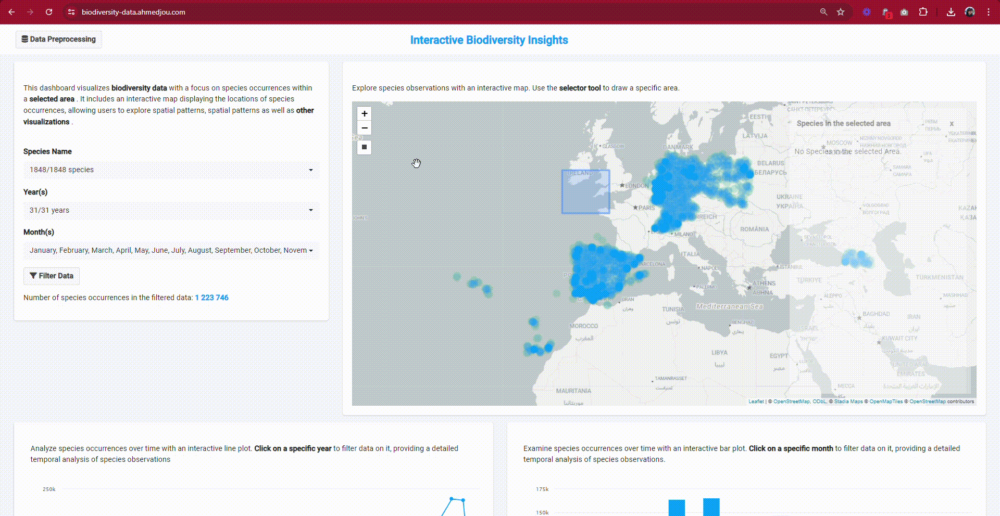

# Homework Extra Assignments

I covered all the extra assignments for the homework. The full assignment details can be found [here](https://docs.google.com/document/d/1E5DgNGL7cl6N1c1wMPmNggmGbRV-p1ySpL_Y-D4akOs/edit?usp=sharing).

## Infrastructure Skill
I deployed the app on a shiny-server installed on my Debian instance. I used a reverse proxy to point to my DNS (quick method): https://biodiversity-data.ahmedjou.com/.

## JavaScript/UI Skill
I used custom CSS to achieve the desired visual effect. Additionally, I implemented three trivial interactive features for the data visualization using JavaScript:
1. **Data Filtering**: Users can filter displayed data by clicking on a specific month or year in the Highcharts bars or lines.
2. **Area Selection**: Users can draw an area on the map to get a list of all species in that area, along with pictures and the links of observations.
3. **Area Filtering**: Users can filter data based on species in the selected areas.

These features and the dashboard's visual appearance are demonstrated in the following GIFs:  


  

## Performance Optimization Skill
### Data Handling
- I basically used `data.table` for efficient data reading, writing, and processing. As my mentor used to say, in R shiny, every second matter 😊.
- A pre-processing feature was added (button in the header), allowing users to limit data to specific countries of interest, reducing the need to load global data. Currently, The app is loading the data of Poland, but it could handle up to 2 millions rows, that's 10 to 15 medium countries.

### Caching
- I Implemented the `bindCache` function to cache previously calculated values of the filtered data.

### Map Rendering
- Since rendering 40 million points on a `leaflet` map is computationally intensive, especially for the client side, I Used pre-rendered tiles (images) directly from the server for rendering Leaflet maps, inspired by the [GBIF leaflet guide](https://data-blog.gbif.org/post/gbif-maps-api-using-r-and-leaflet/).
- A proof of concept is deployed here: https://world.biodiversity-data.ahmedjou.com/. The code is accessible in the [world-data branch](https://github.com/ahmedjoubest/Global-Biodiversity/tree/world-data). I hosted this POC in a different app due to a lack of time to integrate it in the main app.
- Currently, I can directly read the Tiles from the server where it's stored: https://map.ahmedjou.com/service?, and I managed to render all the data.

``` R
addWMSTiles(
       "https://map.ahmedjou.com/service?", layers = "my",
        options = WMSTileOptions(format = "image/png", transparent = TRUE)
      )
```
- **Database**: All data points are stored in a PostgreSQL database with `PostGIS` for efficient handling of geographic data.
- **Map Rendering**: I use `Mapproxy` and `Mapnik` to cache map data at different zoom levels, allowing quick display of relevant data. Real-time rendering is used for very small areas not covered by the cache.


### Future Improvements
- I was planning to optimize for multi-user management to avoid delays caused by a single user pre-processing data.
- Also, `Highcharts` is noted for its rendering speed limitations.

# App Structure

- **R Folder**: Contains modularized R scripts for different parts of the application.
  - **10_mod_filter_fct.R, 10_mod_filter_server.R, 10_mod_filter_ui.R**: Functions, server logic, and UI for filtering.
  - **20_mod_map_fct.R, 20_mod_map_server.R, 20_mod_map_ui.R**: Functions, server logic, and UI for mapping.
  - **30_mod_charts_server.R, 30_mod_charts_ui.R**: Server logic and UI for charts (bar+line).
  - **40_mod_table_server.R, 40_mod_table_ui.R**: Server logic and UI for tables displaying and data downloading.
  - **50_mod_preprocess_fct.R, 50_mod_preprocess_server.R, 50_mod_preprocess_ui.R**: Functions, server logic, and UI for data pre-processing.
  - **60_mod_ui_helpers.R**: Helper functions for UI components.

- **data Folder**: Stores data files used in the application.
  - **countries.rds**: R data file containing all the countries code, used for the pre-processing feature.
  - **occurences_preprocessed.csv**: Pre-processed CSV data file.

- **www Folder**: Contains static assets for the web application.
    - **styles.css**: Custom CSS for styling.
    - **custom.js**: Custom JavaScript functions.

It's worth noting that the modules are not perfectly inter-independent.  

Thank you for your reading.


